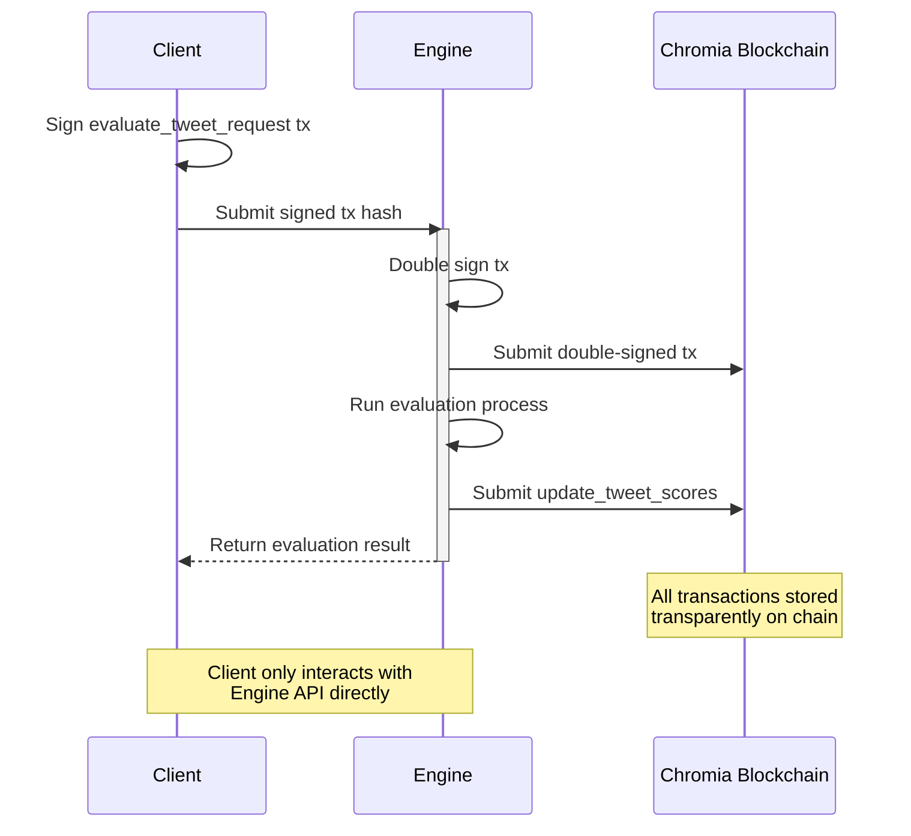

# Eval Engine

### Overview

Eval Engine provides transparent evaluation services powered by Chromia blockchain - a gas-free blockchain that enables seamless user experience without transaction fees. The system consists of three key components:

1. **Chromia Blockchain**: Acts as a transparent, immutable, gas-free database
2. **Engine**: The evaluation service
3. **Client**: The end user requesting evaluations

### Think of it as a Michelin Food Critic

Imagine a Michelin food critic reviewing restaurants. While their evaluation criteria remain private, their final ratings and reviews are public and immutable. Eval Engine works similarly - it processes evaluations through proprietary methods but records all results transparently on Chromia blockchain. Like a Michelin star that can't be bought or manipulated, Eval Engine ensures evaluation integrity through blockchain technology.

## How Eval Engine works?

The evaluation process follows these steps:

1. Client signs an evaluation request transaction
2. Engine receives and double-signs the transaction
3. Engine submits the signed transaction to Chromia blockchain
4. Engine processes the evaluation
5. Engine stores results on the blockchain
6. Client receives the evaluation results

> All transactions and results are permanently stored on Chromia blockchain, ensuring transparency and auditability. Clients interact with the system through a simple SDK/API interface, while the Engine handles all blockchain operations.

### Benefits

* **Transparency**: All evaluations are recorded on blockchain
* **Simplicity**: Clients use a straightforward API
* **Security**: Multi-signature transaction system
* **Auditability**: Complete evaluation history available on-chain

