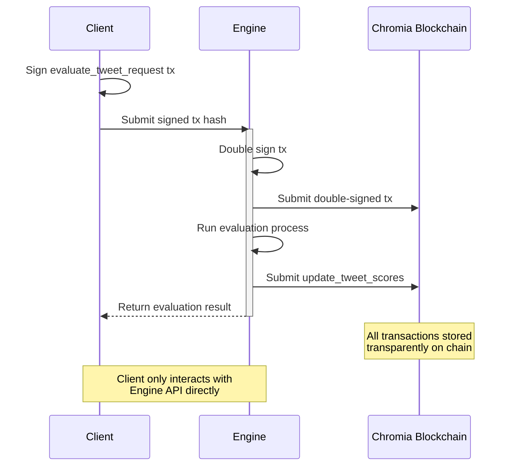

# How Eval Engine works?

The evaluation process follows these steps:

1. Client signs an evaluation request transaction
2. Engine receives and double-signs the transaction
3. Engine submits the signed transaction to Chromia blockchain
4. Engine processes the evaluation
5. Engine stores results on the blockchain
6. Client receives the evaluation results

> All transactions and results are permanently stored on Chromia blockchain, ensuring transparency and auditability. Clients interact with the system through a simple SDK/API interface, while the Engine handles all blockchain operations.

### Evaluation Metrics

* **Factual Accuracy**: Verification of content reliability
* **Creativity**: Assessment of innovative expression
* **Truth**: Evaluation of logical flow
* **Engagement**: Predictive Engagement Model of the reply

### Benefits

* **Transparency**: All evaluations are recorded on blockchain
* **Simplicity**: Clients use a straightforward API
* **Security**: Multi-signature transaction system
* **Auditability**: Complete evaluation history available on-chain
